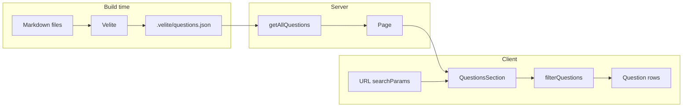

# Technical Architecture
## Frontend Interview Prep

**Last updated:** August 1, 2026

This document describes **what is implemented today**. The codebase is the source of truth.

---

## 1. Tech stack

| Layer | Choice |
|---|---|
| Framework | **Next.js 16** (App Router), **React 19** |
| Language | TypeScript (strict) |
| Styling | **Tailwind CSS 4** (`@import "tailwindcss"`), `tw-animate-css`, `shadcn/tailwind.css` |
| UI | **shadcn/ui** (Radix Nova style): local components under `components/ui/` |
| Content | **Velite 0.4** — markdown → `.velite/` JSON at build time |
| Code highlighting | **rehype-pretty-code** + **Shiki** (`github-dark` theme) |
| Icons | **lucide-react** |
| Package manager | pnpm |

**Fonts** (`app/layout.tsx`): **Lexend** → `--font-heading`, **Geist** → `--font-body` via `next/font/google`. Tailwind maps `font-sans` to body and utilities use `font-heading` where noted.

**Theme:** `html` always has class `dark`; tokens are defined on `:root` and mirrored on `.dark`.

---

## 2. Repository layout (application)

```
app/
  layout.tsx          # fonts, metadata, dark html shell
  page.tsx            # sole route: loads questions, renders homepage
  globals.css         # design tokens + typography utilities + answer prose

content/questions/
  {topic}/{slug}.md   # source of truth for Q&A

components/
  layout/             # header, footer, hero, filter bar, combobox, page frame
  questions/          # list section, row items, markdown wrapper
  ui/                 # shadcn primitives in use

lib/
  content-taxonomy.ts # allowed topics, types, difficulties, labels
  filter-questions.ts # client/server filter + sort
  get-questions.ts    # reads #velite collection
  question-search-params.ts  # URL ↔ filter state
  question-badge-styles.ts
  site-config.ts      # name, hero copy, GitHub link
  utils.ts            # cn()

constants/filters.ts  # dropdown option lists for filter bar

velite.config.ts      # schema, MCQ validation, rehype plugins
```

**Path alias:** `@/*` → project root; `#velite` → `.velite` generated types and data.

**Scripts:** `predev` / `prebuild` run `velite build` (strict on production build).

---

## 3. Content pipeline

### Collection schema (`velite.config.ts`)

- **Pattern:** `questions/**/*.{md,mdx}` under `content/`.
- **Topic** inferred from path segment `questions/{topic}/…`; must be in `ALLOWED_TOPICS`.
- **Slug** from filename; **id** = `{topic}-{slug}`.
- **Body:** markdown → HTML string on the question object (`body`).
- **Plain text** (`plain`) available from Velite for future search indexing; **not used in filters today**.

### MCQ validation (build fails if invalid)

- `type: mcq` requires `options[]` and `correctOptionId` matching an option id.
- Optional `explanation` string shown after the user selects an option.

### Build guardrails

- Strict mode: schema and transform errors fail the build.
- Duplicate `id` values fail in `prepare()`.

---

## 4. Runtime architecture

### Routing

- Only **`/`** is implemented (`app/page.tsx`).
- No dynamic routes, no API routes, no server actions for questions.

### Server render

```text
page.tsx (Server Component)
  getAllQuestions()  → full sorted list from #velite
  getQuestionStats() → total count + distinct topics with content
  └── QuestionsSection (Client) with initialQuestions prop
```

### Client island: `QuestionsSection`

- Reads filters from **`useSearchParams()`** via `parseQuestionSearchParams`.
- Writes filters with **`router.replace(..., { scroll: false })`** so the list updates without scroll jump.
- **Keyword state:** local `keyword` synced from URL; **300ms debounce** before writing `q` back to the URL.
- **Filtering:** `filterQuestions(initialQuestions, { topic, type, difficulty, query })` in `useMemo`.
- **Search scope:** case-insensitive substring match on **`title` + `tags` only** (`lib/filter-questions.ts`).

### URL query parameters

| Param | Meaning | Default |
|---|---|---|
| `topic` | Topic slug | omitted = any |
| `type` | Question type | omitted = any |
| `difficulty` | Difficulty | omitted = any |
| `q` | Keyword | omitted = empty |

Helper: `questionSearchHref(pathname, filters)` in `lib/question-search-params.ts`.

---

## 5. UI composition (homepage)

```text
PageFrame
├── SiteHeader          # logo, GitHub CTA (Button)
├── main (max-w-7xl, border-x)
│   ├── HeroSection     # dynamic stat pill, H1 with accent span, subtitle
│   └── Suspense
│       └── QuestionsSection
│           ├── FilterBar (sticky)
│           └── QuestionList
│               └── QuestionAnswerItem (per row)
└── SiteFooter
```

### Filter bar (`FilterBar`)

- **Desktop (`md+`):** search `Input` + three `FilterCombobox` dropdowns (topic, type, difficulty).
- **Mobile:** search + **Filters** button opening a **Dialog** anchored as a bottom sheet (`FilterDropdownRow` stacked).
- Visual: `filter-bar-stripes` utility, `sticky top-18`, `border-y`.
- Dropdowns: **Popover** + listbox-style buttons (not `<select>`).

### Question rows (`QuestionAnswerItem`)

Branches on `item.type === "mcq"` → `McqQuestionItem`; else `StandardQuestionItem`.

**Standard Q&A**

- Renders `QuestionMarkdown` (HTML from Velite) inside `question-answer-prose` styles.
- **Clamp:** `line-clamp-2` when collapsed; `ResizeObserver` detects overflow to show **See more / See less**.
- **Interaction:** entire title+answer block is clickable when clamped; Enter/Space toggles; links inside answer do not toggle.
- **State:** per-row `useState` for open/closed — **not** URL-persisted; multiple rows may be open.
- **Meta:** badges for topic, type, difficulty, tags (`QuestionMetaRow`).

**MCQ**

- Optional markdown prompt (`body`).
- Options as `Button` outline variants; one selection; then disabled with **success** / **destructive** token styling.
- Shows `explanation` after answer.

**No detail pages:** questions never navigate to another route.

---

## 6. shadcn / UI components in use

| Component | Used by |
|---|---|
| `button` | Header, filter bar, combobox trigger, MCQ options, dialog footer |
| `badge` | Filter count, question meta row |
| `input` | Keyword search |
| `dialog` | Mobile filters sheet |
| `popover` | Filter combobox menus |
| `collapsible` | Standard answer expand (Radix wrapper) |

Removed from the repo (unused): `command`, `input-group`, `textarea` (and `cmdk` dependency).

---

## 7. Design system (`app/globals.css`)

### Color tokens (semantic)

Dark zinc palette with **lime accent** (`--primary` / `--accent`: `#a3e635`).

| Token | Role |
|---|---|
| `--background`, `--foreground` | Page shell (shadcn base) |
| `--surface-1` … `--surface-3` | Elevated surfaces, hovers, MCQ states |
| `--text-primary`, `--text-secondary`, `--text-muted` | Typography hierarchy |
| `--border`, `--border-subtle` | Dividers; subtle used in prose tables/code |
| `--accent`, `--accent-muted-bg` | Hero accent word, logo tile |
| `--primary`, `--destructive`, `--success` | CTAs, MCQ feedback, difficulty badges |
| `--popover`, `--input`, `--ring`, `--muted` | shadcn controls |
| `--code-block-bg`, `--code-inline-bg` | Answer markdown code blocks |

Note: `--border` is a low-alpha hairline (`#e3dcde08`), not solid `#27272A`.

**Badge colors** for topic/type/difficulty/tags also use Tailwind palette utilities in `lib/question-badge-styles.ts` (sky, violet, amber, success, destructive).

### Typography utilities

| Class | Use |
|---|---|
| `text-hero` | Hero H1 (Lexend, responsive down on `<640px`) |
| `text-card-title` | Question titles |
| `text-body` | Answers, empty state |
| `text-meta` | Stat pill, see-more control, badges count |
| `text-nav` | Filter controls, dialog titles |

### Layout conventions

- **Max width:** `max-w-7xl` on main content column.
- **Horizontal padding:** `px-4 md:px-8` on major sections.
- **Header height:** `h-18` (sticky); filter bar sticks below at `top-18`.
- **Row spacing:** `py-6`, `border-b border-border`, `hover:bg-surface-1/50`.
- **Hero padding:** `pt-12 pb-10 md:pt-20 md:pb-14`.

### Answer prose (`.question-answer-prose`)

Scoped styles for paragraphs, lists, tables, inline/block code (pretty-code figures), and strong text inside rendered markdown.

---

## 8. Configuration

- **`lib/site-config.ts`:** product name, hero strings, GitHub URL (placeholder `https://github.com` today).
- Hero stat line on the page is **computed** from Velite (`getQuestionStats()`), not the static string in `siteConfig.hero.statLabel`.

---

## 9. Known limitations & follow-ups

| Area | Current behavior | Possible next step |
|---|---|---|
| Search | Title + tags only | Index `plain` or body in filter or build-time search index |
| List size | Renders all filtered items | Pagination, "load more", or virtualization |
| SEO per question | Single static page | Hash or slug routes that scroll/expand one row |
| `lastUpdated` | In schema only | Show in meta row |
| Results count | Not shown | Add count above list |
| MCQ content | UI + schema ready | Add `type: mcq` markdown files |
| Icons under `components/icons/` | Not referenced | Use for topic visuals or remove |

---

## 10. Reference: filter + expand data flow



---

## END
